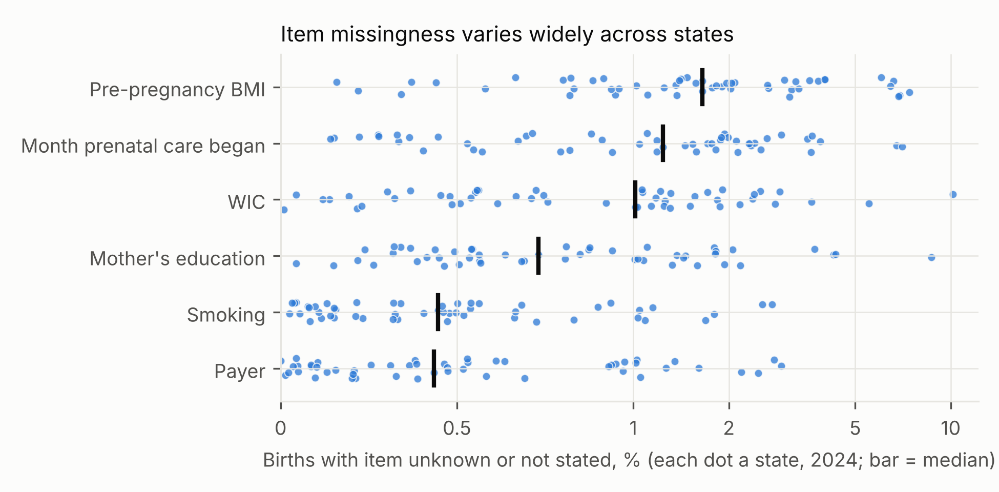
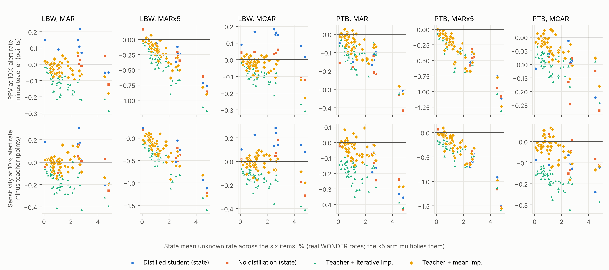
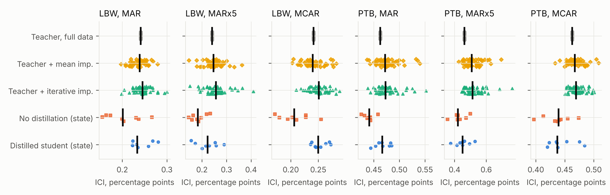
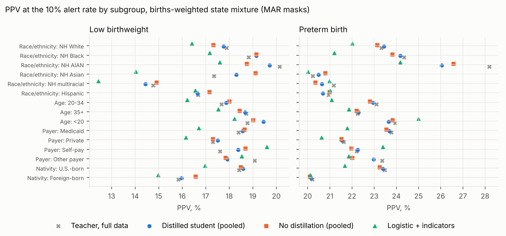

# Missingness-aware knowledge distillation for low birthweight and preterm birth prediction under state-specific item missingness in U.S. birth certificates

Selorm Buaka|University of Northern Colorado|ORCID 0009-0005-3991-4859|othnielbuaka@gmail.com

## Abstract

**Background.** Completeness of birth-certificate items used in perinatal risk prediction (month prenatal care began, pre-pregnancy BMI, WIC receipt, smoking, education, payer) differs sharply across U.S. states. Models developed on complete records are deployed in states where these items are often unknown.

**Methods.** We used NCHS public-use natality files for 2016, 2017, 2023, 2024 and CDC WONDER state-level item-completeness counts. A teacher model was trained on records complete for all six items; students were distilled to operate under each of 51 jurisdictions' observed missingness, simulated under MCAR and covariate-dependent MAR mechanisms. We compared students with imputation and non-distilled baselines on sensitivity and positive predictive value (PPV) at a 10% alert rate, calibration, and subgroup performance in the 2024 births.

**Results.** Test-year prevalence was 6.9% for low birthweight (LBW) and 8.5% for preterm birth (PTB). Under MAR missingness, the median across states of the PPV gap to the full-information teacher was +0.10 points for the state-distilled student versus +0.01 for the same model trained without distillation (LBW), and -0.15 versus -0.19 (PTB). On real test-year records with naturally missing items, the pooled distilled student outperformed imputation (paired bootstrap 95% intervals; LBW: AUROC difference versus mean imputation +0.004 to +0.006, versus iterative imputation +0.013 to +0.016; PTB: AUROC difference versus mean imputation +0.009 to +0.011, versus iterative imputation +0.016 to +0.018).

**Conclusion.** Missingness-aware distillation performed comparably to imputation when state missingness was simulated at real rates, and better than imputation on records with naturally missing items. Evaluating models on naturally incomplete records, not only on simulated masks, changed the conclusion.

## 1. Introduction

Low birthweight and preterm birth remain leading contributors to neonatal morbidity and mortality in the United States, and risk models built on birth-certificate data are attractive because those data cover every registered birth. The variables that carry much of the antenatal signal, however (month prenatal care began, pre-pregnancy body mass index, WIC participation, smoking before pregnancy, maternal education and payer), are also the items most often left unknown on the certificate, and completeness for each item differs from one state to another. A model developed on records where these items are complete will be deployed in jurisdictions where they are not, and the size of that gap depends on where the model is used.

The prediction literature has examined how to handle predictors that are missing at deployment. Hoogland and colleagues compared strategies for validating and applying a model to patients with missing predictor values (Hoogland et al., 2020); Sperrin and colleagues argued that missing data should be handled differently for prediction than for description or causal explanation, favoring approaches available at the moment of prediction (Sperrin et al., 2020); and Sisk and colleagues showed in simulation that imputation and missing-indicator strategies perform differently depending on whether missingness is informative (Sisk et al., 2023). These approaches train each model on the information it will see, or fill in what is missing before applying a model trained on complete data. A separate line of work treats a change in missingness between training and deployment sites as a form of distribution shift and adapts the model to the new site (Zhou et al., 2023).

Knowledge distillation offers a third route. A teacher model trained with full information produces soft predictions, and a student model learns to reproduce them from a reduced set of inputs (Hinton et al., 2015). When the teacher has access to information the student will never see, the arrangement is known as learning with privileged information, and distillation provides a principled way to transfer what the privileged features teach (Lopez-Paz et al., 2016). U.S. vital records suit this design: many records are complete on every item and can train a teacher, while each state's actual pattern of unknown items defines the conditions its student must work under.

We evaluate missingness-aware knowledge distillation (MAKD) for predicting low birthweight and preterm birth from antenatal birth-certificate items. Because the public-use natality files carry no state identifier, we impose each state's observed item-unknown rates from CDC WONDER on national records and compare distilled students with imputation, missing-indicator and non-distilled baselines on the measures that matter when an outcome is rare: sensitivity and positive predictive value at a fixed alert rate, calibration, and subgroup performance. We also evaluate every model on real 2024 records whose items are naturally missing, the one test that does not depend on a simulated missingness mechanism. This work extends the author's earlier neonatal outcome prediction study in Ghana (manuscript under review) to U.S. national data.

## 2. Methods

### 2.1 Data
Live births in the NCHS natality public-use files, 2016, 2017, 2023, 2024. The cohort was restricted to singleton births to U.S.-resident mothers with stated birthweight and obstetric-estimate gestational age between 20 and 44 weeks. Training years 2016, 2017 and 2023 (80% of records); tuning year 2023 (held-out 20%); test year 2024. Public-use files carry no state identifier, so state-specific missingness was taken from CDC WONDER Natality (Expanded): for each state and item, the proportion of births with the item unknown or not stated in 2024. Parsed record counts for U.S. residents matched the registered-birth totals in the National Vital Statistics Reports exactly, and the national unknown rate for each item in WONDER agreed with the microdata to within 0.01 percentage points.

### 2.2 Outcomes and predictors
LBW: birthweight < 2,500 g. PTB: obstetric-estimate gestation < 37 completed weeks. Predictors were restricted to information available before labor: maternal age, race and Hispanic origin, nativity, marital status, whether the father's age was reported, live-birth order, prior live births and prior other pregnancy outcomes, pre-pregnancy diabetes and hypertension, previous preterm birth, infertility treatment, number of previous cesareans and birth year, plus the six items subject to missingness (month prenatal care began, pre-pregnancy BMI, WIC participation, cigarettes per day before pregnancy, maternal education and payer). Prenatal visit count, delivery and infant items were excluded to avoid leakage.

### 2.3 Missingness masks
For record *i*, item *j*, state *s*: P(M_ij = 1 | z_i) = expit(c_sj + β z_i), where z_i is a standardized score of always-observed covariates (maternal age under 20, unmarried, foreign-born, non-Hispanic White, and live-birth order four or higher) and c_sj is solved so that the mean probability equals the state's WONDER rate. β = 0 with independent items gives MCAR; the MAR mechanism used β = 1 with within-record dependence from a one-factor Gaussian copula (ρ = 0.5), which preserves each item's marginal probability. A stress arm (MARx5) multiplied every state's observed rates by 5, capped at 95%, to show behavior under much poorer completeness than any state reports. 

### 2.4 Teacher, students, baselines
Teacher: gradient-boosted trees (LightGBM) on records complete for all items, with 5-fold cross-fitting so that soft targets for the student are out-of-fold. Student: same learner on masked inputs plus missingness indicators, trained with cross-entropy against q = α y + (1 − α) expit(logit(p_T)/τ), α = 0.3, τ = 1.0; per-state students were trained for 8 states (the 6 with the highest mean unknown rate, the median state and the lowest: Alaska, California, District of Columbia, Hawaii, Montana, North Dakota, Oregon, Washington), and one pooled student was trained over the births-weighted mixture of all 51 jurisdictions' masks. Baselines: teacher with mean/mode imputation (B1); teacher with chained-equation imputation (B2); the student's learner trained on hard labels only (B3, the distillation ablation); logistic regression with missing indicators (B4).

### 2.5 Evaluation
Each model was evaluated in 200,000 test-year births under each state's mask. Thresholds for the 10% alert rate and for 80% sensitivity were fixed in the tuning year under the same mask, then applied to the test year. Measures: AUROC, AUPRC, sensitivity and PPV at both operating points, calibration intercept and slope, ICI, Brier score. Uncertainty: stratified bootstrap (200 replicates) for the lowest-, median-, and highest-missingness states and paired differences between distilled and non-distilled students. Subgroups: maternal race and Hispanic origin, age band, payer, nativity. A separate analysis used test-year records with naturally occurring missingness (200,000 records).

## 3. Results
Test-year prevalence was 6.9% for LBW and 8.5% for PTB. Observed state missingness was low: across 51 jurisdictions the mean unknown rate over the six items ranged from 0.1% to 4.8% (Figure 1).

**Simulated state missingness.** At observed rates every tree-based method stayed close to the full-information teacher (Table 1, Figure 2). For LBW the distilled students matched or slightly exceeded the teacher's PPV (median gap +0.10 points for per-state students); for PTB the teacher with mean imputation was closest (-0.05 points). Logistic regression with missing indicators had the lowest AUROC for both outcomes. Compared with the same learner trained on hard labels, the per-state distilled student had higher AUROC in 8 of 8 states for LBW and 8 of 8 for PTB, and higher PPV in 7 and 7 states respectively. Calibration was slightly worse with distillation: the distilled student had the lower ICI in 1 of 8 states for LBW and 0 of 8 for PTB, although all ICIs were below one percentage point (Figure 3).

Table 1. Performance under state missingness simulated at observed rates (MAR masks), test year. Values are medians across all 51 jurisdictions, except per-state models (medians across the 8 states with their own student); gaps are differences from the full-information teacher in the same state. PPV and sensitivity at the 10% alert rate.

| Outcome | Model | AUROC | PPV, % | PPV gap, pts | Sensitivity gap, pts | ICI, % |
|:------|:--------------------------|------:|------:|-------:|---------:|------:|
| LBW | Teacher, full information (reference) | 0.684 | 18.0 | — | — | 0.24 |
| LBW | Distilled student, per state | 0.683 | 18.1 | +0.10 | +0.09 | 0.23 |
| LBW | Distilled student, pooled | 0.683 | 18.2 | +0.11 | +0.08 | 0.26 |
| LBW | Non-distilled student, per state (B3) | 0.682 | 18.1 | +0.01 | -0.01 | 0.20 |
| LBW | Non-distilled student, pooled (B3) | 0.682 | 18.1 | +0.08 | +0.05 | 0.22 |
| LBW | Teacher + mean imputation (B1) | 0.683 | 18.0 | -0.03 | -0.01 | 0.24 |
| LBW | Teacher + iterative imputation (B2) | 0.682 | 17.9 | -0.09 | -0.15 | 0.25 |
| LBW | Logistic regression + indicators (B4) | 0.655 | 16.6 | -1.44 | -1.47 | 0.32 |
| PTB | Teacher, full information (reference) | 0.672 | 22.8 | — | — | 0.46 |
| PTB | Distilled student, per state | 0.671 | 22.7 | -0.15 | -0.15 | 0.47 |
| PTB | Distilled student, pooled | 0.671 | 22.7 | -0.10 | -0.05 | 0.47 |
| PTB | Non-distilled student, per state (B3) | 0.669 | 22.7 | -0.19 | -0.13 | 0.44 |
| PTB | Non-distilled student, pooled (B3) | 0.670 | 22.6 | -0.26 | -0.14 | 0.42 |
| PTB | Teacher + mean imputation (B1) | 0.671 | 22.8 | -0.05 | -0.03 | 0.47 |
| PTB | Teacher + iterative imputation (B2) | 0.670 | 22.7 | -0.11 | -0.18 | 0.47 |
| PTB | Logistic regression + indicators (B4) | 0.644 | 21.4 | -1.44 | -1.70 | 0.60 |

**Missingness mechanism.** Gaps were similar under MCAR and MAR masks. When every state's rates were multiplied by five, PPV relative to the teacher fell for every method; the pooled students degraded least among the students (Table 2).

Table 2. Median PPV gap to the full-information teacher (percentage points, 10% alert rate) by missingness mechanism.

| Outcome | Model | MCAR | MAR | MAR, rates ×5 |
|:------|:------------------------------|--------:|--------:|--------:|
| LBW | Distilled student, per state | +0.15 | +0.10 | -0.23 |
| LBW | Distilled student, pooled | +0.17 | +0.11 | -0.04 |
| LBW | Non-distilled student, per state (B3) | +0.04 | +0.01 | -0.29 |
| LBW | Non-distilled student, pooled (B3) | +0.09 | +0.08 | -0.03 |
| LBW | Teacher + mean imputation (B1) | -0.02 | -0.03 | -0.16 |
| LBW | Teacher + iterative imputation (B2) | -0.08 | -0.09 | -0.29 |
| LBW | Logistic regression + indicators (B4) | -1.40 | -1.44 | -1.54 |
| PTB | Distilled student, per state | -0.10 | -0.15 | -0.47 |
| PTB | Distilled student, pooled | -0.08 | -0.10 | -0.19 |
| PTB | Non-distilled student, per state (B3) | -0.11 | -0.19 | -0.46 |
| PTB | Non-distilled student, pooled (B3) | -0.14 | -0.26 | -0.24 |
| PTB | Teacher + mean imputation (B1) | -0.03 | -0.05 | -0.22 |
| PTB | Teacher + iterative imputation (B2) | -0.10 | -0.11 | -0.23 |
| PTB | Logistic regression + indicators (B4) | -1.40 | -1.44 | -1.54 |

**Naturally missing items.** In a random sample of 200,000 test-year records with at least one item missing (18,772 LBW and 23,492 PTB events), the pooled distilled student had the highest AUROC for both outcomes, and every paired interval for its AUROC advantage over mean imputation, iterative imputation and the non-distilled student excluded zero (Table 3). The interval for its PPV advantage excluded zero over iterative imputation for both outcomes, over mean imputation for both outcomes, and over the non-distilled student for PTB only.

Table 3. Test-year records with at least one naturally missing item (models trained under MAR masks). Differences are paired bootstrap intervals for the pooled distilled student minus each comparator.

| Outcome | Model | AUROC (95% CI) | PPV, % (95% CI) | AUROC difference, distilled − model (95% CI) | PPV difference, pts (95% CI) |
|:-----|:------------------|:-----------|:-----------|:------------|:------------|
| LBW | Distilled student, pooled | 0.683 (0.679–0.687) | 24.6 (24.2–25.1) | — | — |
| LBW | Non-distilled student, pooled (B3) | 0.681 (0.677–0.685) | 24.5 (23.9–25.0) | +0.001 to +0.003 | -0.05 to +0.39 |
| LBW | Teacher + mean imputation (B1) | 0.677 (0.674–0.682) | 24.3 (23.9–24.9) | +0.004 to +0.006 | +0.01 to +0.61 |
| LBW | Teacher + iterative imputation (B2) | 0.669 (0.665–0.673) | 23.4 (22.9–23.9) | +0.013 to +0.016 | +0.97 to +1.61 |
| LBW | Logistic regression + indicators (B4) | 0.649 (0.645–0.654) | 22.3 (21.9–22.8) | +0.031 to +0.036 | +1.95 to +2.77 |
| PTB | Distilled student, pooled | 0.685 (0.681–0.689) | 31.6 (31.2–32.2) | — | — |
| PTB | Non-distilled student, pooled (B3) | 0.682 (0.678–0.686) | 31.4 (31.0–32.0) | +0.002 to +0.004 | +0.05 to +0.43 |
| PTB | Teacher + mean imputation (B1) | 0.675 (0.671–0.679) | 31.2 (30.7–31.8) | +0.009 to +0.011 | +0.24 to +0.63 |
| PTB | Teacher + iterative imputation (B2) | 0.668 (0.664–0.672) | 30.6 (30.2–31.2) | +0.016 to +0.018 | +0.75 to +1.25 |
| PTB | Logistic regression + indicators (B4) | 0.647 (0.644–0.651) | 29.2 (28.7–29.9) | +0.036 to +0.041 | +1.94 to +2.82 |

**Subgroups.** PPV at the 10% alert rate by maternal race and Hispanic origin, age band, payer and nativity is shown in Figure 4. Among the tree-based methods, PPV differed by less than one percentage point in 22 of 30 outcome-by-subgroup cells, and no method was consistently best; logistic regression had the lowest PPV in 22 of 30. Larger differences occurred in smaller subgroups, where estimates are less precise.

## 4. Discussion
**Principal findings.** Two pictures emerge. On simulated state missingness at the rates states actually report, every tree-based method stayed within a fraction of a percentage point of the full-information teacher's positive predictive value; logistic regression with missing indicators trailed by more than a point. Distilled students matched or slightly exceeded the teacher for low birthweight, while a teacher combined with simple mean imputation was as good or better for preterm birth. On real 2024 records with naturally missing items, the ordering was clearer: the pooled distilled student had higher AUROC than every baseline in both outcomes, with bootstrap intervals that excluded zero. Its PPV was also higher than both imputation approaches for both outcomes.

**Why the two tests disagree.** The simulated masks assume missingness that is completely at random or that depends only on observed covariates. Real unknown items on birth certificates are unlikely to behave that way: a blank prenatal-care field may itself reflect limited or late care, so missingness carries information about risk. Models trained on masked inputs with explicit missingness indicators can use that signal, whereas imputing a plausible value into a complete-data teacher discards it. This is consistent with prior arguments that the handling of missing data in prediction should preserve, rather than remove, informative missingness (Sperrin et al., 2020; Sisk et al., 2023). Distillation added a small but consistent AUROC gain over the same learner trained on hard labels, in line with the view of soft targets as lower-variance supervision (Hinton et al., 2015; Lopez-Paz et al., 2016).

**Implications.** Because real state-level item missingness is low (the median state leaves each item unknown for about one percent of births), the practical benefit of any missing-data strategy for most jurisdictions is small. Where it matters most is in the records that are incomplete, which are not a random subset of births; there, a distilled student trained to expect missing items outperformed imputation. Per-state students did not improve on a single pooled student in this analysis, which suggests a single national student trained across state missingness patterns may be sufficient.

**Limitations.** State missingness was simulated from WONDER marginal rates because public-use files lack state identifiers; the joint and outcome-related structure of real state missingness is not captured, and the natural-missingness analysis is national rather than state-specific. Training used 2016, 2017 and 2023 only; 2018–2022 were unavailable for this analysis. Predictors are recorded on the certificate at or after delivery; completeness does not guarantee accuracy (Martin et al., 2013); and only gradient-boosted trees were studied. Subgroup results are descriptive.

**Conclusion.** For low birthweight and preterm birth prediction from U.S. birth certificates, missingness-aware knowledge distillation performed comparably to imputation on simulated state missingness at real rates and better than imputation on records with naturally missing items. Evaluating models on naturally incomplete records, not only on simulated masks, changed the conclusion and should be standard when deployment-time missingness is at issue.

## Declarations
**Use of AI tools.** Claude (Anthropic) was used to write and test analysis code, process data, search the literature, generate figures, and draft parts of the text. The author designed the study, made the modeling decisions, and reviewed the manuscript and takes responsibility for its content.

**Data and code availability.** The NCHS natality public-use files and CDC WONDER are publicly available; no microdata are redistributed. Analysis code is available from the author on request.

## References

Austin PC, Steyerberg EW. The Integrated Calibration Index (ICI) and related metrics for quantifying the calibration of logistic regression models. *Statistics in Medicine*. 2019;38(21):4051–4065. doi:10.1002/sim.8281

Centers for Disease Control and Prevention, National Center for Health Statistics. Natality, 2016–2024 expanded, on CDC WONDER Online Database. https://wonder.cdc.gov/natality-expanded-current.html. Accessed October 7, 2026.

Collins GS, Moons KGM, Dhiman P, Riley RD, et al. TRIPOD+AI statement: updated guidance for reporting clinical prediction models that use regression or machine learning methods. *BMJ*. 2024;385:e078378.

Hinton G, Vinyals O, Dean J. Distilling the knowledge in a neural network. arXiv:1503.02531. 2015.

Hoogland J, van Barreveld M, Debray TPA, Reitsma JB, Verstraelen TE, Dijkgraaf MGW, Zwinderman AH. Handling missing predictor values when validating and applying a prediction model to new patients. *Statistics in Medicine*. 2020;39(25):3591–3607. doi:10.1002/sim.8682

Lopez-Paz D, Bottou L, Schölkopf B, Vapnik V. Unifying distillation and privileged information. *International Conference on Learning Representations (ICLR)*. 2016. arXiv:1511.03643

Martin JA, Wilson EC, Osterman MJK, Saadi EW, Sutton SR, Hamilton BE. Assessing the quality of medical and health data from the 2003 birth certificate revision: results from two states. *National Vital Statistics Reports*. 2013;62(2).

National Center for Health Statistics. Natality public-use data files and User Guides, 2016–2024. https://ftp.cdc.gov/pub/Health_Statistics/NCHS/

Osterman MJK, Hamilton BE, Martin JA, Driscoll AK, Valenzuela CP. Births: final data for 2024. *National Vital Statistics Reports*. 2026;75(2). doi:10.15620/cdc/252440

Sisk R, Sperrin M, Peek N, van Smeden M, Martin GP. Imputation and missing indicators for handling missing data in the development and deployment of clinical prediction models: a simulation study. *Statistical Methods in Medical Research*. 2023;32(8):1461–1477. doi:10.1177/09622802231165001

Sperrin M, Martin GP, Sisk R, Peek N. Missing data should be handled differently for prediction than for description or causal explanation. *Journal of Clinical Epidemiology*. 2020. doi:10.1016/j.jclinepi.2020.03.028

Zhou H, Balakrishnan S, Lipton ZC. Domain adaptation under missingness shift. *Proceedings of the 26th International Conference on Artificial Intelligence and Statistics*, PMLR 206. 2023:9577–9606.
